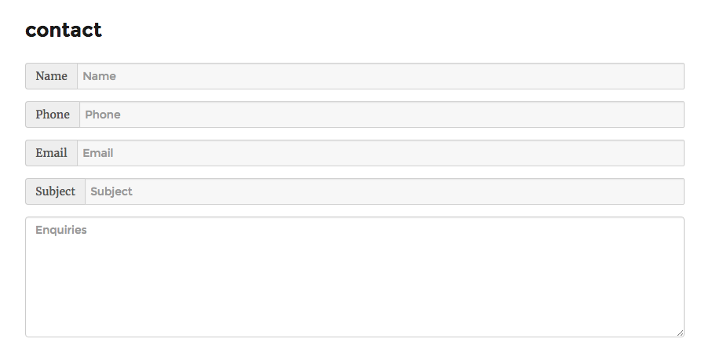
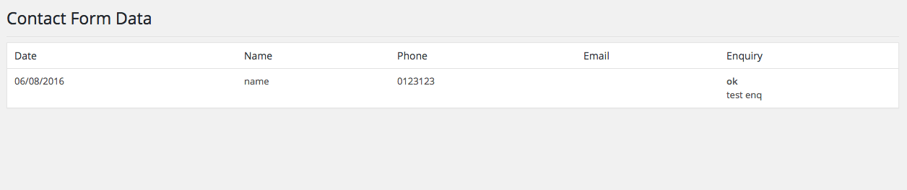
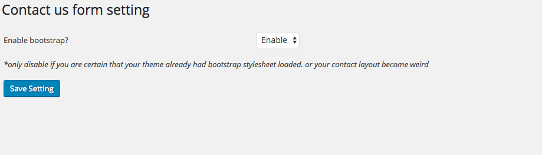
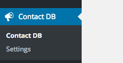

# aics-db-contact-form

wordpress contact form shortcode with database on submission

---









---

## How to install

You can download this repo in .ZIP file and upload it on your wp-admin inside plugins page


## How to use

place this shortcode in your desired page.

```

[aics_contact_form]

```

## How it will work

every submission will be recorded to database and will be emailed to admin email

## What happen when user submit contact form?

1. Form data will be recorded to database
2. System will send email to admin
3. Admin can view the record in the admin page

---
developer: [AiCS Businesses](http://aics.my)


AiCS Businesses is a Malaysian based web developer resides in Kuala Lumpur